## ขั้นตอนการติดตั้ง **Jenkins**

### ขั้นตอนที่ 1 
ทำการดาวน์โหลด **Jenkins** จาก https://www.jenkins.io/download/
โดยเลือก **Download Jenkins version for : Windows** (ในกรณีที่ใช้ระบบปฏิบัติการ Windows)
	
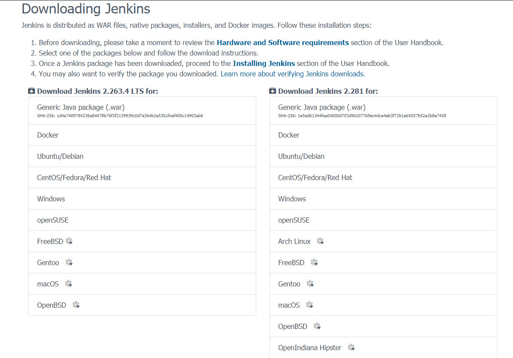
	
(ในที่นี้ใช้ version 2.281)

	> หากในเครื่องไม่มี JRE ต้องทำการติดตั้ง JRE ก่อน โดยสามารถดูได้จาก cmd และพิมพ์ java
	> โดยสามารถดาวน์โหลดได้จาก https://www.oracle.com/java/technologies/javase-jre8-downloads.html
	> เมื่อติดตั้งเสร็จแล้วให้ทำการ **PATH** ที่อยู่ของ Java แล้วรีสตาร์ทเครื่อง
	
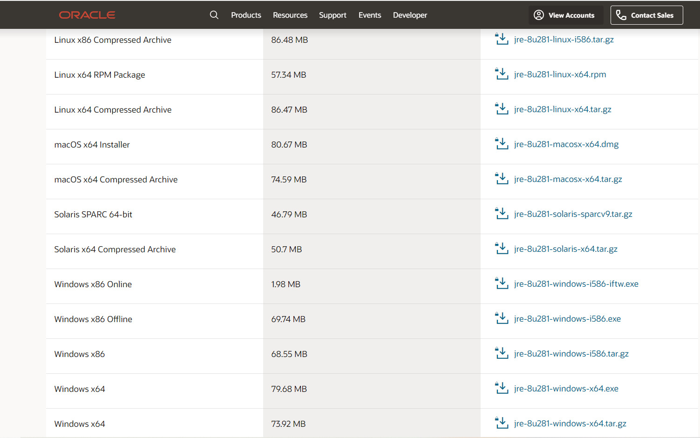
	
### ขั้นตอนที่ 2
เมื่อทำการดาวน์โหลดเสร็จแล้วให้ทำการติดตั้ง 

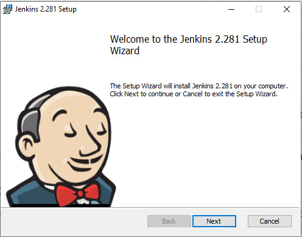

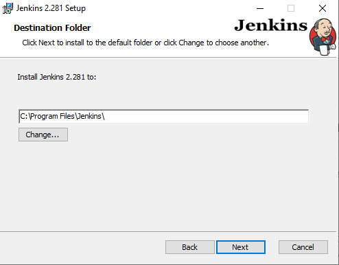
เลือกที่อยู่ที่จะติดตั้ง จากนั้นกด **Next**

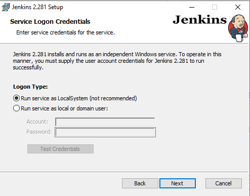

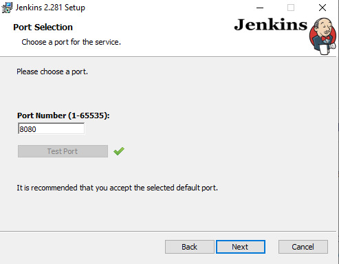
กด **testport** จากนั้นกด **Next**
	> Start port default ของ Jenkins จะใช้ :8080 หากในเครื่องมีเครื่องมืออื่นที่ใช้ port:8080 อยู่ Jenkins จะไม่ทำงาน

	
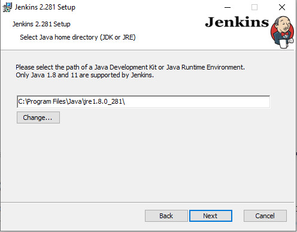

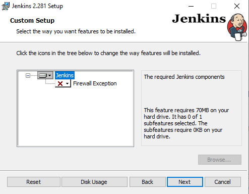
	
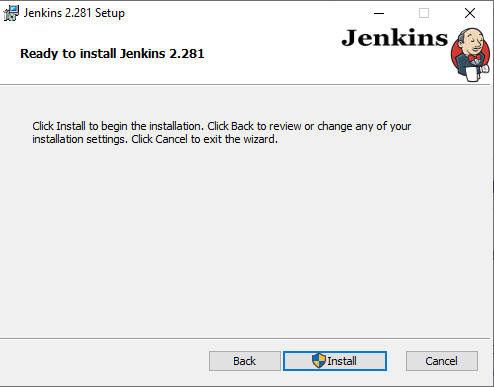
	
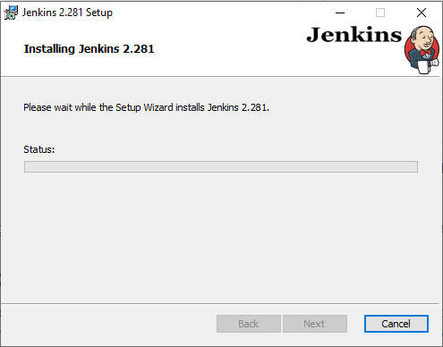

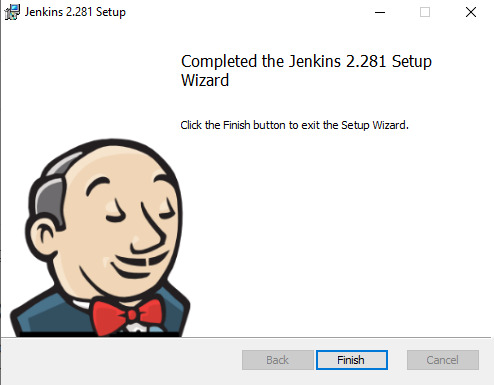
เมื่อติดตั้งเสร็จแล้วให้กด Finish จากนั้นจะมีเว็บขึ้นมา 

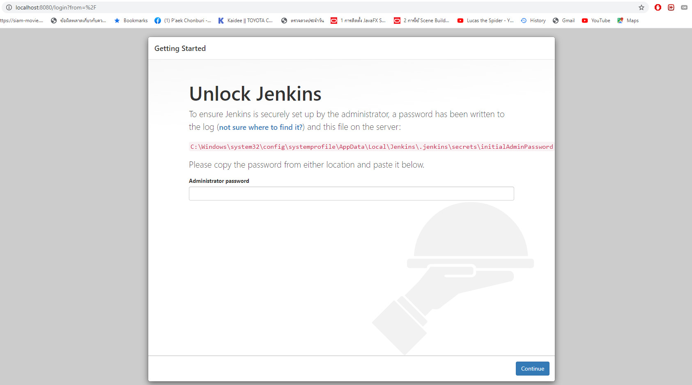
จากนั้นให้นำ Password ที่ได้จาก PATH สีแดงมากรอก

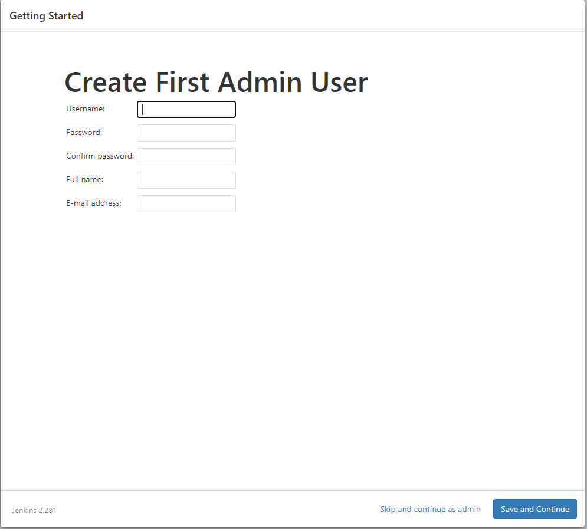
เมื่อกรอก Password แล้วจะให้สร้าง User Admin ให้ทำการ Create User เมื่อเสร็จแล้วกด Save and Continue

เมื่อสร้าง user admin สำเร็จ ให้ทำการ login เป็นการเสร็จสิ้นการติดตั้ง Jenkins
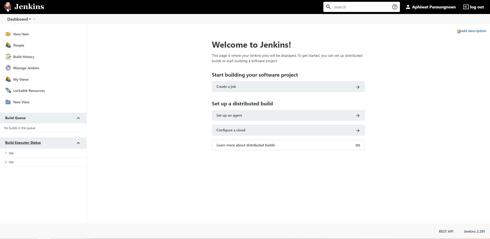

